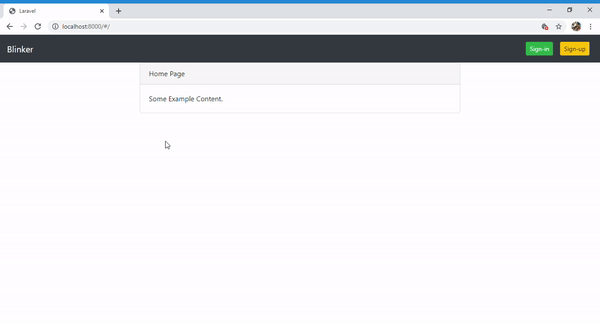

# Laravel & Vue - Car Search

Steps to perform:

* Rename .env.example file to .env

* composer install
* npm install
* php artisan key:generate
* set up your database user & password in the .env file
* create the mysql database and set the name to .env file
 * php artisan migrate
* php artisan passport:install
* copy the new generated passport-client secret from console or from your database and paste in in your .env key PASSPORT_CLIENT_SECRET

example in .env file --PASSPORT_CLIENT_SECRET=500ZpBmmUKCj3EoTBM0wc8r

create an account on pusher and paste the details in below variables , found in .env file
PUSHER_APP_ID=""
PUSHER_APP_KEY=""
PUSHER_APP_SECRET=""
PUSHER_APP_CLUSTER=""

*php artisan optimize

To run TEST:

php artisan config:clear

vendor/bin/phpunit --verbose -c phpunit.xml
